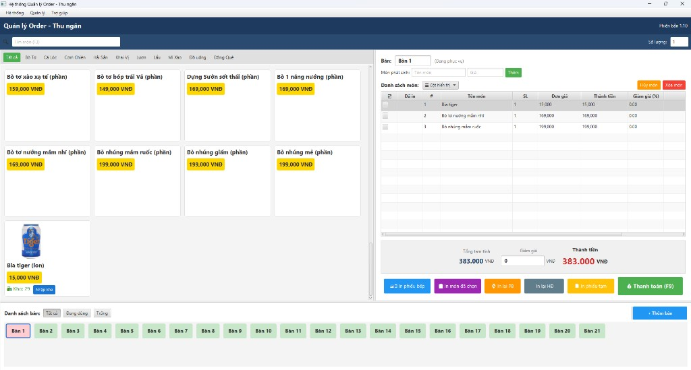
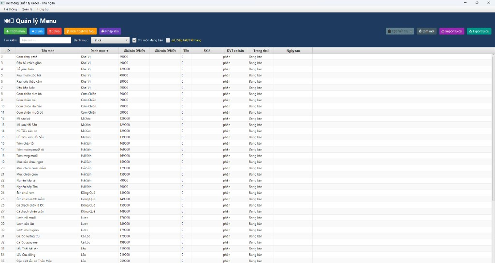
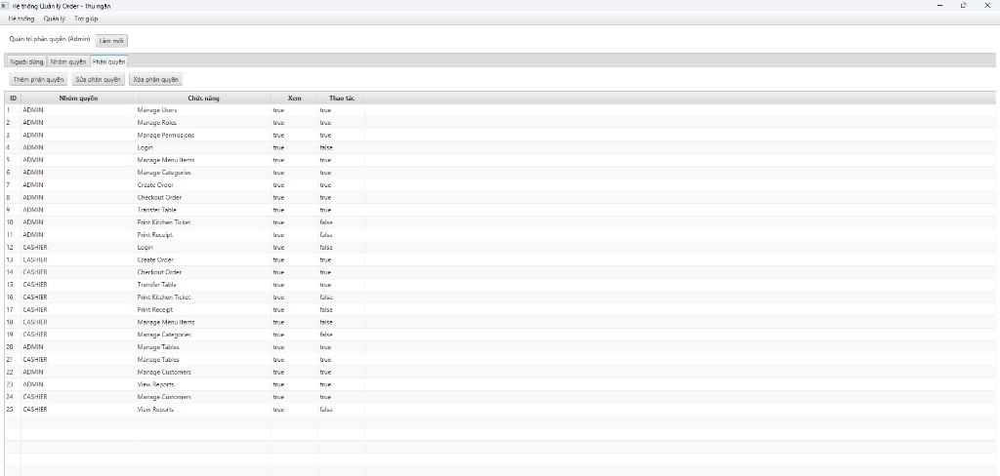
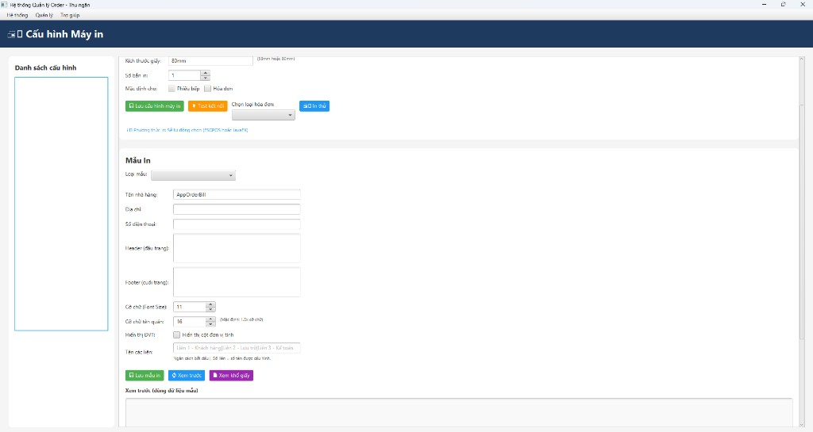
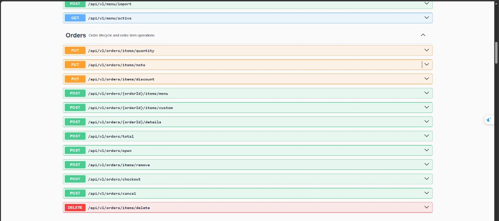
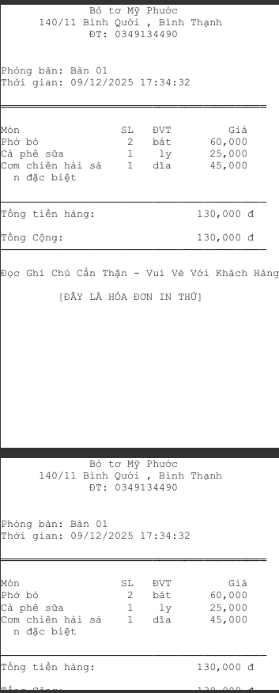
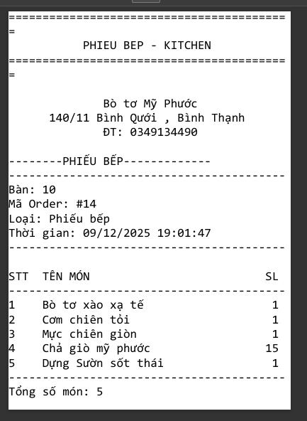

# AppOrderBill — Hệ thống gọi món & thanh toán

> Ứng dụng giúp nhà hàng/quán ăn quản lý gọi món, in phiếu bếp, thanh toán và báo cáo doanh thu, gồm **POS Desktop** và **REST API**.

---

## 📌 Tính năng chính

- **POS Desktop (JavaFX + SQLite)**
  - Quản lý bàn, gọi món, giảm giá, huỷ món.
  - In **phiếu bếp** và **hoá đơn** theo mẫu cấu hình.
  - Quản lý menu, tồn kho, import/export Excel.
  - Quản lý khách hàng và tích điểm.
- **REST API (Spring Boot + Swagger)**
  - API cho menu, orders, billing, kitchen, tables, reporting, printer, system.
  - Phân quyền theo **user/role/permission** (module Identity).
  - Hỗ trợ profile **MySQL** dùng cho luồng API, giữ nguyên SQLite cho POS.

---

## 🚀 Quick start

### Chạy API (mặc định, SQLite)

```bash
mvn -DskipTests spring-boot:run
```

- Swagger UI: `http://localhost:8080/swagger-ui/index.html`
- OpenAPI: `http://localhost:8080/v3/api-docs`

### Chạy API với MySQL (`api-mysql` profile)

```bash
mvn -DskipTests spring-boot:run "-Dspring-boot.run.profiles=api-mysql"
```

Cấu hình tại `src/main/resources/application-api-mysql.yml` hoặc biến môi trường:

- `MYSQL_URL`
- `MYSQL_USER`
- `MYSQL_PASSWORD`

### Chạy POS Desktop (JavaFX)

```bash
mvn javafx:run
```

---

## 🧱 Cấu trúc dự án (tóm tắt)

```text
CNPM_AppOrderBill/
├── src/main/java/com/giadinh/apporderbill/
│   ├── javafx/                 # UI desktop (JavaFX controllers, màn hình POS)
│   ├── web/                    # REST controllers + ApiExceptionHandler + security
│   ├── web/config/             # Wiring theo profile (SQLite / MySQL) + OpenAPI config
│   ├── catalog/                # Menu, tồn kho, import/export Excel
│   ├── orders/                 # Đơn hàng, order items, checkout
│   ├── billing/                # Thanh toán (payments), in/reprint hoá đơn
│   ├── kitchen/                # In phiếu bếp
│   ├── table/                  # Quản lý bàn, clear/transfer/reservation
│   ├── customer/               # Khách hàng & tích điểm
│   ├── identity/               # User/role/permission + kiểm tra quyền
│   ├── reporting/              # Báo cáo doanh thu
│   ├── printer/                # Cấu hình máy in & template
│   └── shared/                 # Error codes, util, services dùng chung
├── src/main/resources/
│   ├── application.properties          # Cấu hình API mặc định (SQLite)
│   ├── application-api-mysql.yml       # Cấu hình API dùng MySQL
│   ├── messages*.properties            # Đa ngôn ngữ (VN/EN)
├── docs/                       # Bộ tài liệu theo module + guides
│   ├── guides/                 # getting-started, deployment, testing
│   ├── modules/                # Tài liệu cho từng module domain
│   └── screenshots/            # Hình ảnh minh hoạ UI & Swagger
├── docker/
│   └── mysql/init/01-schema.sql# Schema MySQL cho profile api-mysql
├── output/                     # SQLite DB (ví dụ: output/pos.db)
├── designAPI.md                # Thiết kế API (contract)
├── project_documentation.md    # Tổng quan kiến trúc + profile + verify
├── unit_test.md                # Chuẩn unit test
└── unit_test_scenarios.md      # Kịch bản unit test chi tiết
```

---

## 🔐 Authorization (API)

- Header bắt buộc cho endpoint bảo vệ: `X-Username: <username>`
- Quy ước:
  - `401 Unauthorized`: thiếu header hoặc user không tồn tại.
  - `403 Forbidden`: user tồn tại nhưng **không đủ quyền** cho function.
- Logic chi tiết:
  - `web/security/ApiAuthorizationService`
  - `identity/` (IdentityComponent, CheckAccessUseCase, IdentityDataInitializer)

Xem thêm:

- `docs/modules/web-api.md`
- `docs/modules/identity.md`

---

## 📚 Tài liệu

- **Index tài liệu**: [`docs/README.md`](docs/README.md)
- **Thiết kế API**: [`designAPI.md`](designAPI.md)
- **Tổng quan 1 trang**: [`project_documentation.md`](project_documentation.md)
- **Hướng dẫn chạy nhanh**: [`docs/guides/getting-started.md`](docs/guides/getting-started.md)
- **Testing**: [`docs/guides/testing.md`](docs/guides/testing.md)

---

## 🖼 Hình ảnh minh hoạ

### POS Desktop

| Màn hình | Ảnh |
|---------|-----|
| Order/Thu ngân |  |
| Quản lý Menu |  |
| Quản lý phân quyền |  |
| Cấu hình máy in |  |

### REST API (Swagger UI)

- Tổng quan: 
- Danh sách endpoint: 

### Mẫu in

- Phiếu bếp: 
- Hoá đơn: 

---

## 📄 License

Dự án sử dụng giấy phép **MIT**. Xem file [`LICENSE`](LICENSE).

---

Cập nhật: 2026-04-08.  
Maintainer: (bạn có thể ghi tên/nhóm tại đây).***
