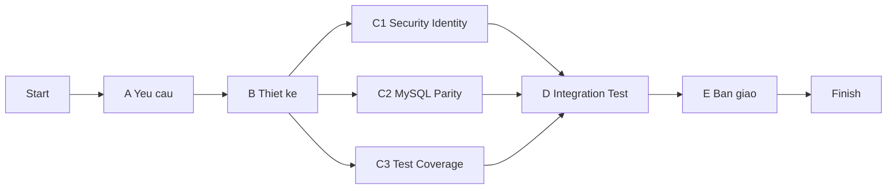

# KẾ HOẠCH LAB06 - APPORDERBILL

## 1) Thông tin chung

- Dự án: AppOrderBill
- Thời lượng: 6 tuần
- Nhân sự: 5 thành viên
- Mục tiêu: Hoàn thiện kế hoạch quản lý dự án theo khung LAB06 và triển khai các hạng mục ưu tiên theo hiện trạng mã nguồn.

## 2) Phạm vi và tiêu chí hoàn thành (Finalize Scope)

### 2.1 Phạm vi chức năng trong 6 tuần

Phạm vi thực hiện bám các module hiện có:

- API và backend nghiệp vụ:
  - `orders`, `billing`, `kitchen`, `identity`, `reporting`, `table`, `catalog`, `customer`
  - Tham chiếu: `src/main/java/com/giadinh/apporderbill`
- API endpoints:
  - `src/main/java/com/giadinh/apporderbill/web/*Controller.java`
- UI desktop:
  - `src/main/resources/com/giadinh/apporderbill/javafx`
- Hạ tầng dữ liệu:
  - `docker-compose.yml`
  - `docker/mysql/init/01-schema.sql`

### 2.2 Ngoài phạm vi

- Không phát triển frontend web SPA mới.
- Không thay đổi kiến trúc tổng thể sang microservices trong đợt 6 tuần.
- Không triển khai CI/CD enterprise hoàn chỉnh (chỉ chuẩn bị checklist sẵn sàng tích hợp).

### 2.3 Tiêu chí hoàn thành

- Hoàn thành backlog Must-have của các luồng: order, billing, kitchen, identity.
- Hoàn thiện đồng bộ dữ liệu MySQL cho các phần thiếu quan trọng.
- Tăng độ bao phủ test cho các luồng chính (unit + API integration mức cốt lõi).
- Có bộ tài liệu bàn giao gồm: tài liệu sử dụng, tài liệu kỹ thuật, kế hoạch kiểm thử, checklist release.
- Có bản chạy được qua Docker để demo nghiệm thu.

## 3) WBS chi tiết theo 6 tuần (Build WBS + Gantt)

| WBS ID | Nhóm công việc | Đầu ra chính |
|---|---|---|
| WBS-1 | Quản trị dự án | Lịch họp, biên bản họp, báo cáo tuần |
| WBS-2 | Khảo sát và chốt yêu cầu | Backlog theo Must/Should/Could, baseline phạm vi |
| WBS-3 | Phân tích thiết kế | Luồng nghiệp vụ, đặc tả API/DB thay đổi |
| WBS-4 | Triển khai kỹ thuật | Chức năng đã code + test pass theo scope |
| WBS-5 | Kiểm thử và ổn định | Báo cáo test, danh sách lỗi và trạng thái xử lý |
| WBS-6 | Bàn giao và nghiệm thu | Gói release + tài liệu + demo |

### 3.1 WBS phân rã công việc

| Công việc | Mô tả | Tuần |
|---|---|---|
| WBS-1.1 | Kickoff, chốt vai trò, thiết lập nhịp họp | 1 |
| WBS-1.2 | Báo cáo tiến độ hàng tuần, kiểm soát thay đổi | 1-6 |
| WBS-2.1 | Thu thập yêu cầu từ hiện trạng module | 1 |
| WBS-2.2 | Chốt backlog Must/Should/Could và acceptance criteria | 1 |
| WBS-3.1 | Chuẩn hóa luồng order -> kitchen -> billing | 2 |
| WBS-3.2 | Rà soát schema SQLite/MySQL và điểm lệch | 2 |
| WBS-4.1 | Củng cố `identity` (đăng nhập/phân quyền) | 3 |
| WBS-4.2 | Hoàn thiện parity MySQL cho phần còn thiếu | 3-4 |
| WBS-4.3 | Bổ sung test cho luồng nghiệp vụ chính | 3-4 |
| WBS-5.1 | Integration test theo kịch bản nghiệp vụ | 5 |
| WBS-5.2 | Sửa lỗi hồi quy, ổn định bản phát hành | 5 |
| WBS-6.1 | Chuẩn bị tài liệu và video demo | 6 |
| WBS-6.2 | Đóng gói release Docker và checklist bàn giao | 6 |

### 3.2 Gantt 6 tuần

| Công việc | W1 | W2 | W3 | W4 | W5 | W6 |
|---|---|---|---|---|---|---|
| WBS-1 Quản trị dự án | X | X | X | X | X | X |
| WBS-2 Khảo sát/chốt yêu cầu | X |  |  |  |  |  |
| WBS-3 Phân tích thiết kế |  | X |  |  |  |  |
| WBS-4 Triển khai kỹ thuật |  |  | X | X |  |  |
| WBS-5 Kiểm thử và ổn định |  |  |  |  | X |  |
| WBS-6 Bàn giao |  |  |  |  |  | X |

## 4) Bảng phân công trách nhiệm (Define Ownership)

### 4.1 Vai trò

- TV1: PM/BA
- TV2: Backend Core
- TV3: Backend Data
- TV4: QA/Test
- TV5: UI/Docs/Release

### 4.2 Ma trận RACI

| Công việc | TV1 PM/BA | TV2 Backend Core | TV3 Backend Data | TV4 QA/Test | TV5 UI/Docs/Release |
|---|---|---|---|---|---|
| Chốt yêu cầu và backlog | A/R | C | C | C | I |
| Thiết kế luồng nghiệp vụ | A | R | C | C | I |
| Cải tiến luồng orders/billing API | C | A/R | C | C | I |
| Đồng bộ MySQL schema/repository | C | C | A/R | C | I |
| Viết và chạy test | C | C | C | A/R | I |
| Sửa lỗi hồi quy | C | R | R | A | I |
| Tài liệu, demo, đóng gói release | C | I | C | C | A/R |
| Báo cáo tiến độ và rủi ro | A/R | C | C | C | C |

Ghi chú:
- A = Accountable, R = Responsible, C = Consulted, I = Informed.

## 5) PERT và phụ thuộc công việc

### 5.0 Cơ sở tính theo tài liệu môn học (Chương 3 và 4)

- Theo Chương 3 (Quản lý dự án): dùng WBS -> mạng công việc -> PERT/đường găng để quản trị tiến độ.
- Theo Chương 4 (Ước lượng giá phần mềm): chi phí gắn với công sức (effort), có thể quy đổi từ thời gian và nguồn lực.
- Công thức PERT áp dụng:
  - Thời gian kỳ vọng: `TE = (to + 4tm + tp) / 6`
  - Phương sai: `Var = ((tp - to) / 6)^2`
- Quy đổi chi phí nhân công theo khung LAB:
  - `ChiPhi = TE(week) * 5(ngay/tuan) * 4(gio/ngay) * SoNguoi * 120,000`
- Mức lương dùng để tính: `120.000 VNĐ/người/giờ` (giờ làm việc bình thường).

- A: Khảo sát/chốt yêu cầu (Tuần 1)
- B: Phân tích thiết kế (Tuần 2) - phụ thuộc A
- C1: Củng cố security/identity (Tuần 3-4) - phụ thuộc B
- C2: Đồng bộ MySQL (Tuần 3-4) - phụ thuộc B
- C3: Mở rộng test coverage (Tuần 3-4) - phụ thuộc B
- D: Kiểm thử tích hợp và sửa lỗi (Tuần 5) - phụ thuộc C1, C2, C3
- E: Bàn giao (Tuần 6) - phụ thuộc D

### 5.1 Bảng PERT (công việc trước đó, thời gian, chi phí)

| Công việc | Công việc trước đó | to | tm | tp | TE (tuần) | Var | Số người | Chi phí (triệu đồng) |
|---|---|---|---|---|---|---|---|---|
| A | - | 0.8 | 1.0 | 1.2 | 1.000 | 0.0044 | 2 | 4.80 |
| B | A | 0.8 | 1.0 | 1.4 | 1.033 | 0.0100 | 3 | 7.44 |
| C1 | B | 1.5 | 2.0 | 2.5 | 2.000 | 0.0278 | 2 | 9.60 |
| C2 | B | 1.5 | 2.0 | 2.4 | 1.983 | 0.0225 | 2 | 9.52 |
| C3 | B | 1.2 | 2.0 | 2.2 | 1.900 | 0.0278 | 2 | 9.12 |
| D | C1, C2, C3 | 0.8 | 1.0 | 1.5 | 1.050 | 0.0136 | 4 | 10.08 |
| E | D | 0.8 | 1.0 | 1.2 | 1.000 | 0.0044 | 3 | 7.20 |

Tổng chi phí nhân công theo PERT (toàn bộ công việc A-E): `57.76 triệu đồng`.

### 5.2 Sơ đồ PERT

### 5.3 Đường găng (critical path) dự kiến

- Đường găng: A -> B -> C1 -> D -> E (6 tuần).
- C2 và C3 chạy song song với C1, nhưng không được trễ hơn mốc bắt đầu của D.
- Kỳ vọng thời gian đường găng:
  - `TE_CP = 1.000 + 1.033 + 2.000 + 1.050 + 1.000 = 6.083 tuần`
- Độ lệch chuẩn đường găng:
  - `Sigma_CP = sqrt(0.0044 + 0.0100 + 0.0278 + 0.0136 + 0.0044) = 0.246 tuần`

### 5.4 Ghi chú liên hệ ước lượng phần mềm (Chương 4)

- Quy mô code hiện tại của hệ thống (để tham chiếu): ~`20,061 LOC` Java trong `src/main/java`.
- Kế hoạch 6 tuần này là pha nâng cấp/hoàn thiện theo scope đã chốt, do đó chi phí PERT ở trên được dùng làm baseline quản trị tiến độ và ngân sách ngắn hạn.
- Nếu cần ước lượng cho toàn bộ vòng đời sản phẩm (không chỉ 6 tuần), có thể lập thêm một bảng riêng theo COCOMO/FP để so sánh.

### 5.5 Xác suất hoàn thành theo deadline (PERT)

Giả sử thời gian hoàn thành đường găng tuân theo phân phối chuẩn:

- Trung bình: `Mu = 6.083` tuần
- Độ lệch chuẩn: `Sigma = 0.246` tuần
- Công thức chuẩn hóa: `Z = (Deadline - Mu) / Sigma`

| Deadline mục tiêu (tuần) | Z-score | Xác suất hoàn thành lũy tích |
|---|---:|---:|
| 6.0 | -0.34 | 36.8% |
| 6.2 | 0.48 | 68.4% |
| 6.5 | 1.69 | 95.5% |
| 6.8 | 2.91 | 99.8% |
| 7.0 | 3.73 | 99.99% |

Kết luận quản trị:

- Cam kết mốc `6 tuần` có rủi ro tương đối cao (xác suất đạt khoảng `36.8%`).
- Mốc `6.5 tuần` an toàn hơn nhiều (khoảng `95.5%`).
- Nếu bắt buộc giữ `6 tuần`, cần dự phòng phạm vi hoặc tăng nguồn lực ở nhánh đường găng `A-B-C1-D-E`.

## 6) Quản lý rủi ro (Risk Register)

| ID | Nhóm rủi ro | Mô tả rủi ro | Mức độ (1-5) | Xác suất (1-5) | Exponent | Ứng phó |
|---|---|---|---|---|---|---|
| R1 | Scope & Requirement | Yêu cầu thay đổi giữa kỳ | 4 | 3 | 12 | Chốt baseline tuần 1, thay đổi phải qua PM |
| R2 | Environment | Lệch dữ liệu giữa SQLite và MySQL | 5 | 3 | 15 | Kiểm soát schema, có dữ liệu mẫu chuẩn |
| R3 | Execution | Tắc nghẽn tuần 3-4 do dồn việc | 4 | 4 | 16 | Giới hạn WIP, họp ngắn hàng ngày |
| R4 | Customers & Users | Phản hồi UAT đến muộn | 3 | 3 | 9 | Lên lịch review sớm từ cuối tuần 2 |
| R5 | Tools | Môi trường máy thành viên không đồng nhất | 3 | 3 | 9 | Chuẩn hóa chạy bằng Docker và guide |
| R6 | People | Thành viên nghỉ đột xuất hoặc giảm công suất | 4 | 2 | 8 | Có backup ownership và handover ngắn |

Ngưỡng ưu tiên xử lý:
- Exponent >= 15: ưu tiên rất cao
- Exponent 10-14: ưu tiên cao
- Exponent < 10: theo dõi định kỳ

## 7) Danh sách deliverables bàn giao (Delivery Pack)

| Mã | Deliverable | Người phụ trách chính | Thời điểm hoàn tất |
|---|---|---|---|
| D1 | Backlog và phạm vi baseline (Must/Should/Could) | TV1 | Cuối tuần 1 |
| D2 | Tài liệu thiết kế luồng nghiệp vụ và thay đổi DB | TV2, TV3 | Cuối tuần 2 |
| D3 | Mã nguồn cập nhật theo scope + test pass | TV2, TV3, TV4 | Cuối tuần 5 |
| D4 | Báo cáo kiểm thử và danh sách lỗi đã xử lý | TV4 | Cuối tuần 5 |
| D5 | Tài liệu người dùng + tài liệu kỹ thuật | TV5 | Tuần 6 |
| D6 | Video demo + checklist release Docker | TV5 | Tuần 6 |
| D7 | Biên bản nghiệm thu nội bộ và bàn giao | TV1 | Cuối tuần 6 |

## 8) Nhịp quản trị dự án

- Họp tiến độ: 20h thứ 7 hàng tuần.
- Daily sync nội bộ: 10-15 phút trong giai đoạn tuần 3-5.
- Mẫu báo cáo tuần:
  - Kế hoạch tuần trước / kết quả thực tế / chênh lệch
  - Rủi ro mới và trạng thái rủi ro cũ
  - Kế hoạch tuần kế tiếp

## 9) Kết luận

Kế hoạch 6 tuần này bám đúng cấu trúc LAB06 (WBS, Gantt, PERT, phân công, rủi ro, bàn giao) và được hiệu chỉnh theo tình trạng thực tế của AppOrderBill để đảm bảo khả năng hoàn thành trong phạm vi nhân sự 5 thành viên.
