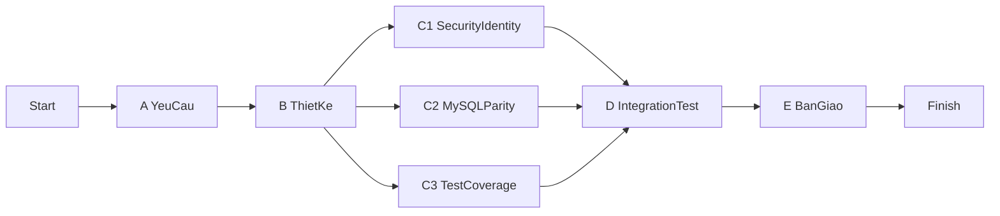

# TÀI LIỆU HỢP NHẤT QUẢN LÝ DỰ ÁN PHẦN MỀM

## 1) Thông tin tài liệu

- Dự án: AppOrderBill
- Phạm vi kế hoạch: 6 tuần, 5 thành viên
- Tài liệu nguồn:
  - `CNPMNC-Chuong 3-Quan ly du an.pdf`
  - `CNPMNC-Chuong 4-Uoc luong gia phan mem.pdf`
  - `docs/LAB06_KE_HOACH_AppOrderBill_6Tuan.md`

## 2) Chương 3 - Quản lý dự án (làm theo từng bước)

### Bước 1: Xác định mục tiêu dự án

| Mục tiêu | Mô tả áp dụng cho AppOrderBill |
|---|---|
| Đúng tiến độ | Hoàn thành phạm vi 6 tuần theo mốc W1-W6 |
| Đúng chi phí | Kiểm soát theo baseline chi phí PERT |
| Đúng chất lượng | Luồng order-billing-kitchen chạy ổn định, test đạt |

### Bước 2: Xây dựng WBS (Work Breakdown Structure)

| WBS ID | Nhóm công việc | Đầu ra |
|---|---|---|
| WBS-1 | Quản trị dự án | Lịch họp, báo cáo tuần |
| WBS-2 | Khảo sát/chốt yêu cầu | Backlog baseline |
| WBS-3 | Phân tích thiết kế | Luồng nghiệp vụ + thay đổi DB/API |
| WBS-4 | Triển khai kỹ thuật | Chức năng theo scope + test |
| WBS-5 | Kiểm thử và ổn định | Báo cáo test + sửa lỗi |
| WBS-6 | Bàn giao | Release + tài liệu + demo |

### Bước 3: Lập tiến độ bằng Gantt

| Công việc | W1 | W2 | W3 | W4 | W5 | W6 |
|---|---|---|---|---|---|---|
| WBS-1 Quản trị dự án | X | X | X | X | X | X |
| WBS-2 Khảo sát/chốt yêu cầu | X |  |  |  |  |  |
| WBS-3 Phân tích thiết kế |  | X |  |  |  |  |
| WBS-4 Triển khai kỹ thuật |  |  | X | X |  |  |
| WBS-5 Kiểm thử và ổn định |  |  |  |  | X |  |
| WBS-6 Bàn giao |  |  |  |  |  | X |

### Bước 3b: Áp dụng Agile (Scrum) cho kế hoạch 6 tuần

#### 3b.1 Khung Agile sử dụng

| Thành phần | Áp dụng cho AppOrderBill |
|---|---|
| Framework | Scrum |
| Độ dài sprint | 2 tuần/sprint |
| Số sprint | 3 sprint trong 6 tuần |
| Team size | 5 thành viên |
| Đơn vị theo dõi | Story point + task hoàn thành |

#### 3b.2 Vai trò Agile

| Vai trò Scrum | Gán trong nhóm 5 người |
|---|---|
| Product Owner (PO) | TV1 (PM/BA) |
| Scrum Master (SM) | TV1 kiêm nhiệm (hoặc TV4 hỗ trợ theo dõi trở ngại) |
| Developers | TV2, TV3, TV5 |
| QA | TV4 |

#### 3b.3 Product Backlog theo ưu tiên

| Epic | User Story chính | Ưu tiên |
|---|---|---|
| Order Flow | Mở bàn, thêm món, sửa/hủy món, in bếp | Must |
| Checkout Flow | Thanh toán, in hóa đơn, in lại | Must |
| Data Parity | Đồng bộ SQLite/MySQL cho luồng chính | Must |
| Reporting | Doanh thu ngày/tuần/tháng + lịch sử bill | Should |
| Admin/Config | Phân quyền, cấu hình in, hướng dẫn | Should |

#### 3b.4 Sprint Plan (6 tuần)

| Sprint | Thời gian | Sprint Goal | Deliverable |
|---|---|---|---|
| Sprint 1 | W1-W2 | Chốt backlog + hoàn thiện thiết kế + ổn định luồng order cơ bản | Backlog baseline, luồng order chạy ổn |
| Sprint 2 | W3-W4 | Hoàn thiện checkout + parity MySQL + tăng test | Luồng thanh toán ổn định, test tăng |
| Sprint 3 | W5-W6 | Regression, tối ưu, tài liệu và bàn giao | Bản release, docs, demo nghiệm thu |

#### 3b.5 Nghi thức Scrum

| Nghi thức | Tần suất | Mục tiêu |
|---|---|---|
| Sprint Planning | Đầu mỗi sprint | Chốt scope sprint và ước lượng task |
| Daily Scrum | Mỗi ngày (10-15 phút) | Cập nhật tiến độ, blocker |
| Sprint Review | Cuối sprint | Demo kết quả cho stakeholder nội bộ |
| Sprint Retrospective | Cuối sprint | Cải tiến cách làm cho sprint sau |

#### 3b.6 Chỉ số theo dõi Agile

| Chỉ số | Cách đo |
|---|---|
| Velocity | Tổng story point hoàn thành/sprint |
| Sprint Burndown | Số task còn lại theo ngày trong sprint |
| Defect Leakage | Số lỗi lọt qua từng sprint |
| Scope Change | Số story thêm/bớt giữa sprint |

### Bước 4: Lập mạng PERT và đường găng

| Công việc | Trước đó | Ý nghĩa |
|---|---|---|
| A | - | Khảo sát/chốt yêu cầu |
| B | A | Phân tích thiết kế |
| C1 | B | Triển khai security/identity |
| C2 | B | Đồng bộ dữ liệu và luồng nghiệp vụ giữa SQLite và MySQL (parity) |
| C3 | B | Mở rộng test coverage |
| D | C1,C2,C3 | Kiểm thử tích hợp |
| E | D | Bàn giao |

### Bước 5: Quản lý rủi ro theo quy trình Chương 3

#### 5.1 Xác định rủi ro theo nhóm

| Nhóm rủi ro | Ví dụ trong dự án |
|---|---|
| Công nghệ | Lệch hành vi SQLite và MySQL |
| Nhân sự | Thiếu người tại giai đoạn W3-W4 |
| Tổ chức | Chậm phê duyệt thay đổi phạm vi |
| Công cụ | Khác biệt môi trường Docker các máy |
| Yêu cầu | Thay đổi yêu cầu giữa kỳ |
| Ước tính | Thiếu effort cho hồi quy |

#### 5.2 Phân tích mức độ rủi ro

`Exponent = Xác suất x Ảnh hưởng`

| Mức điểm | Mức ưu tiên |
|---|---|
| 1-9 | Theo dõi |
| 10-14 | Cao |
| 15-25 | Rất cao |

#### 5.3 Bảng risk register áp dụng

| ID | Nhóm | Rủi ro | Ảnh hưởng | Xác suất | Exponent | Ứng phó |
|---|---|---|---:|---:|---:|---|
| R1 | Scope | Thay đổi yêu cầu giữa kỳ | 4 | 3 | 12 | Chốt baseline tuần 1 |
| R2 | Environment | Lệch SQLite/MySQL | 5 | 3 | 15 | Chuẩn hóa schema/data mẫu |
| R3 | Execution | Dồn việc W3-W4 | 4 | 4 | 16 | Giới hạn WIP, daily sync |
| R4 | Users | UAT phản hồi muộn | 3 | 3 | 9 | Review sớm từ cuối W2 |
| R5 | People | Biến động nhân sự | 4 | 2 | 8 | Backup ownership |

#### 5.4 Rủi ro đặc thù khi áp dụng Agile

| ID | Rủi ro Agile | Ảnh hưởng | Cách kiểm soát |
|---|---|---|---|
| AR1 | Scope creep trong sprint | Trễ sprint goal | Khóa phạm vi sau Sprint Planning |
| AR2 | Story quá lớn, khó hoàn thành | Dồn việc cuối sprint | Chia nhỏ story trước khi commit sprint |
| AR3 | Daily Scrum hình thức | Không phát hiện blocker sớm | Scrum Master ghi nhận blocker bắt buộc |
| AR4 | Không review thường xuyên với PO | Làm sai kỳ vọng | Sprint Review đúng định kỳ, demo sớm |

## 3) Chương 4 - Ước lượng giá phần mềm (làm theo từng bước)

### Bước 1: Chọn phương pháp ước lượng phù hợp

| Phương pháp | Dữ liệu đầu vào | Dùng trong tài liệu này |
|---|---|---|
| Expert Judgment | Kinh nghiệm chuyên gia | Dùng kiểm tra chéo |
| Analogy | Dự án tương tự | Dùng tham khảo |
| COCOMO | KLOC + hệ số | Dùng nền tảng lý thuyết |
| PERT effort-cost | to/tm/tp + nhân lực + đơn giá | Dùng để chốt chi phí 6 tuần |

### Bước 2: Ước lượng kích thước phần mềm

#### 2.1 Theo LOC/KLOC

- Quy mô Java hiện tại (tham chiếu): khoảng `20,061 LOC` trong `src/main/java`.

#### 2.2 Theo Function Point (bảng trọng số tham chiếu)

| Thành phần FP | Đơn giản | Trung bình | Phức tạp |
|---|---:|---:|---:|
| EI (Input) | 3 | 4 | 6 |
| EO (Output) | 4 | 5 | 7 |
| EQ (Inquiry) | 3 | 4 | 6 |
| ILF | 7 | 10 | 15 |
| EIF | 5 | 7 | 10 |

### Bước 3: Ước lượng effort-time theo COCOMO (khung chuẩn)

| Loại dự án | ab | bb | cb | db |
|---|---:|---:|---:|---:|
| Organic | 2.4 | 1.05 | 2.5 | 0.38 |
| Semi-detached | 3.0 | 1.12 | 2.5 | 0.35 |
| Embedded | 3.6 | 1.20 | 2.5 | 0.32 |

Công thức:

- `E = ab x S^bb`
- `T = cb x E^db`
- `P = E / T`

### Bước 4: Ước lượng chi phí trực tiếp cho kế hoạch 6 tuần bằng PERT

#### 4.1 Công thức sử dụng

- `TE = (to + 4tm + tp) / 6`
- `Var = ((tp - to) / 6)^2`
- `ChiPhi = TE(week) x 5(ngày/tuần) x 4(giờ/ngày) x SốNgười x 120000`

#### 4.2 Bảng quy đổi đơn giá

| Thông số | Giá trị |
|---|---|
| Giờ làm việc chuẩn/ngày | 4 giờ |
| Ngày làm việc/tuần | 5 ngày |
| Đơn giá | 120,000 VNĐ/giờ |
| 1 người-tuần | 2,400,000 VNĐ |

#### 4.3 Bảng PERT chi tiết và chi phí

| Công việc | Trước đó | to | tm | tp | TE (tuần) | Var | Số người | Chi phí (triệu đồng) |
|---|---|---|---|---|---|---|---|---|
| A | - | 0.8 | 1.0 | 1.2 | 1.000 | 0.0044 | 2 | 4.80 |
| B | A | 0.8 | 1.0 | 1.4 | 1.033 | 0.0100 | 3 | 7.44 |
| C1 | B | 1.5 | 2.0 | 2.5 | 2.000 | 0.0278 | 2 | 9.60 |
| C2 | B | 1.5 | 2.0 | 2.4 | 1.983 | 0.0225 | 2 | 9.52 |
| C3 | B | 1.2 | 2.0 | 2.2 | 1.900 | 0.0278 | 2 | 9.12 |
| D | C1,C2,C3 | 0.8 | 1.0 | 1.5 | 1.050 | 0.0136 | 4 | 10.08 |
| E | D | 0.8 | 1.0 | 1.2 | 1.000 | 0.0044 | 3 | 7.20 |

Tổng chi phí nhân công dự án theo PERT: **57.76 triệu đồng**.

### Bước 5: Tính đường găng, thời gian kỳ vọng và xác suất deadline

#### 5.1 Bảng ES/EF/LS/LF/Slack

| Công việc | TE | ES | EF | LS | LF | Slack |
|---|---:|---:|---:|---:|---:|---:|
| A | 1.000 | 0.000 | 1.000 | 0.000 | 1.000 | 0.000 |
| B | 1.033 | 1.000 | 2.033 | 1.000 | 2.033 | 0.000 |
| C1 | 2.000 | 2.033 | 4.033 | 2.033 | 4.033 | 0.000 |
| C2 | 1.983 | 2.033 | 4.016 | 2.050 | 4.033 | 0.017 |
| C3 | 1.900 | 2.033 | 3.933 | 2.133 | 4.033 | 0.100 |
| D | 1.050 | 4.033 | 5.083 | 4.033 | 5.083 | 0.000 |
| E | 1.000 | 5.083 | 6.083 | 5.083 | 6.083 | 0.000 |

Đường găng: `A -> B -> C1 -> D -> E`.

#### 5.2 Tính xác suất hoàn thành theo deadline

- `Mu = 6.083 tuần`
- `Sigma = 0.246 tuần`
- `Z = (Deadline - Mu)/Sigma`

| Deadline (tuần) | Z-score | Xác suất hoàn thành |
|---|---:|---:|
| 6.0 | -0.34 | 36.8% |
| 6.2 | 0.48 | 68.4% |
| 6.5 | 1.69 | 95.5% |
| 6.8 | 2.91 | 99.8% |
| 7.0 | 3.73 | 99.99% |

## 4) Áp dụng vào kế hoạch LAB06 AppOrderBill

### 4.1 Phân công vai trò

| Vai trò | Thành viên |
|---|---|
| PM/BA | TV1 |
| Backend Core | TV2 |
| Backend Data | TV3 |
| QA/Test | TV4 |
| UI/Docs/Release | TV5 |

### 4.2 Ma trận RACI rút gọn

| Công việc | TV1 | TV2 | TV3 | TV4 | TV5 |
|---|---|---|---|---|---|
| Chốt yêu cầu/backlog | A/R | C | C | C | I |
| Triển khai orders/billing | C | A/R | C | C | I |
| Đồng bộ MySQL | C | C | A/R | C | I |
| Kiểm thử hồi quy | C | R | R | A | I |
| Tài liệu + demo + release | C | I | C | C | A/R |

### 4.3 Deliverables bàn giao

| Mã | Deliverable | Owner chính | Mốc hoàn thành |
|---|---|---|---|
| D1 | Baseline yêu cầu + backlog | TV1 | Cuối W1 |
| D2 | Tài liệu thiết kế + DB changes | TV2,TV3 | Cuối W2 |
| D3 | Mã nguồn theo scope + test pass | TV2,TV3,TV4 | Cuối W5 |
| D4 | Báo cáo kiểm thử/sửa lỗi | TV4 | Cuối W5 |
| D5 | Tài liệu người dùng + kỹ thuật | TV5 | W6 |
| D6 | Video demo + checklist release | TV5 | W6 |
| D7 | Biên bản nghiệm thu nội bộ | TV1 | Cuối W6 |

## 5) Kết luận

Tài liệu đã được viết lại hoàn toàn bằng tiếng Việt có dấu, đồng thời trình bày **theo từng bước đúng tinh thần Chương 3 và Chương 4**: từ xác định mục tiêu, WBS, Gantt, PERT, quản lý rủi ro đến ước lượng chi phí và xác suất deadline. Nội dung này là phiên bản hợp nhất dùng trực tiếp cho báo cáo LAB06 của AppOrderBill.
