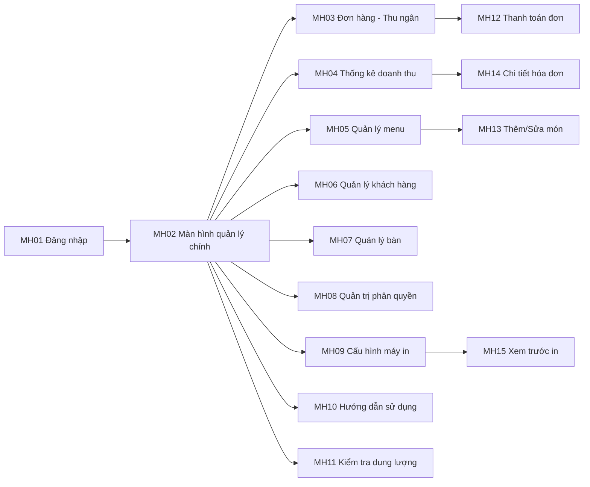

# 5. Thiết kế giao diện theo mẫu Lab 4

Tài liệu này mô tả thiết kế giao diện của AppOrderBill theo đúng cấu trúc mẫu Lab 4:

- 5.1 Sơ đồ liên kết các màn hình
- 5.2 Danh sách các màn hình
- 5.3 Mô tả chi tiết từng màn hình

Nguồn đối chiếu thực tế:

- `src/main/resources/com/giadinh/apporderbill/main-layout.fxml`
- `src/main/resources/com/giadinh/apporderbill/javafx/**/*.fxml`
- `src/main/java/com/giadinh/apporderbill/MainLayoutController.java`
- `src/main/java/com/giadinh/apporderbill/OrderScreenController.java`

## 5.1 Sơ đồ liên kết các màn hình

## 5.2 Danh sách các màn hình

| STT | Màn hình | Loại màn hình | Chức năng |
|---|---|---|---|
| 1 | Màn hình Đăng nhập | Màn hình chính | Xác thực người dùng trước khi vào hệ thống |
| 2 | Màn hình Quản lý chính | Màn hình chính | Điều hướng đến các module nghiệp vụ |
| 3 | Màn hình Đơn hàng - Thu ngân | Nhập liệu + tra cứu | Tạo/mở order, thêm món, in bếp, thanh toán |
| 4 | Màn hình Thống kê doanh thu | Báo biểu + tra cứu | Xem doanh thu theo ngày/tuần/tháng, xem lịch sử thanh toán |
| 5 | Màn hình Quản lý menu | Nhập liệu + tra cứu | Quản lý danh mục món, tồn kho, import/export |
| 6 | Màn hình Quản lý khách hàng | Nhập liệu + tra cứu | Tìm kiếm, thêm/sửa/xóa khách hàng |
| 7 | Màn hình Quản lý bàn | Nhập liệu + tra cứu | Quản lý thông tin bàn, trạng thái bàn |
| 8 | Màn hình Quản trị phân quyền | Nhập liệu + tra cứu | Quản lý người dùng, nhóm quyền, phân quyền chức năng |
| 9 | Màn hình Cấu hình máy in | Nhập liệu + cấu hình | Cấu hình máy in, mẫu in, in thử |
| 10 | Màn hình Hướng dẫn sử dụng | Thông tin/hướng dẫn | Hiển thị hướng dẫn thao tác cho người dùng |
| 11 | Màn hình Kiểm tra dung lượng | Thông tin hệ thống | Hiển thị dung lượng DB và ổ đĩa |
| 12 | Màn hình Thanh toán đơn | Hộp thoại nhập liệu | Chốt thanh toán, tính tiền thối, chọn phương thức |
| 13 | Màn hình Thêm/Sửa món | Hộp thoại nhập liệu | Cập nhật thông tin chi tiết món hàng |
| 14 | Màn hình Chi tiết hóa đơn | Hộp thoại tra cứu | Hiển thị chi tiết các dòng món của hóa đơn |
| 15 | Màn hình Xem trước in | Hộp thoại hiển thị | Xem trước nội dung in và chỉnh mức zoom |

## 5.3 Mô tả các màn hình

### 5.3.1 Màn hình Đăng nhập (MH01)

**a. Giao diện**

- Tiêu đề đăng nhập hệ thống.
- 2 ô nhập tên đăng nhập/mật khẩu.
- Vùng thông báo lỗi đăng nhập.
- Nút Đăng nhập và Thoát.

**b. Mô tả các đối tượng trên màn hình**

| STT | Tên | Kiểu | Ràng buộc | Chức năng |
|---|---|---|---|---|
| 1 | `usernameField` | TextField | Không rỗng | Nhập tên đăng nhập |
| 2 | `passwordField` | PasswordField | Không rỗng | Nhập mật khẩu |
| 3 | `messageLabel` | Label | Chỉ hiển thị | Hiển thị lỗi/thông báo |
| 4 | `onLoginClick` | Button action | Kiểm tra đầu vào | Thực hiện đăng nhập |
| 5 | `onCancelClick` | Button action | Không | Thoát màn hình đăng nhập |

### 5.3.2 Màn hình Quản lý chính (MH02)

**a. Giao diện**

- Thanh menu gồm Hệ thống, Quản lý, Trợ giúp.
- Vùng nội dung trung tâm `contentPane` hiển thị màn hình con theo điều hướng.

**b. Mô tả các đối tượng trên màn hình**

| STT | Tên | Kiểu | Ràng buộc | Chức năng |
|---|---|---|---|---|
| 1 | `contentPane` | StackPane | Luôn có màn hình con | Vùng hiển thị nội dung nghiệp vụ |
| 2 | `showOrderScreen` | MenuItem action | Quyền truy cập | Mở màn hình đơn hàng |
| 3 | `showDashboardScreen` | MenuItem action | Quyền truy cập | Mở màn hình thống kê |
| 4 | `showMenuManagementScreen` | MenuItem action | Theo quyền | Mở quản lý menu |
| 5 | `showCustomerManagementScreen` | MenuItem action | Theo quyền | Mở quản lý khách hàng |
| 6 | `showTableManagementScreen` | MenuItem action | Theo quyền | Mở quản lý bàn |
| 7 | `showAdminManagementScreen` | MenuItem action | Admin | Mở quản trị phân quyền |
| 8 | `showPrinterConfigScreen` | MenuItem action | Theo quyền | Mở cấu hình máy in |
| 9 | `showUserGuideScreen` | MenuItem action | Không | Mở hướng dẫn sử dụng |
| 10 | `showStorageUsageDialog` | MenuItem action | Không | Mở kiểm tra dung lượng |

### 5.3.3 Màn hình Đơn hàng - Thu ngân (MH03)

**a. Giao diện**

- Header tìm kiếm món và nhập nhanh số lượng.
- Khu danh sách món theo danh mục.
- Khu bảng chi tiết order với cột linh hoạt.
- Khu tổng tiền/giảm giá/thành tiền.
- Khu tác vụ: in bếp, in lại, in phiếu tạm, thanh toán.
- Khu danh sách bàn và bộ lọc trạng thái bàn.

**b. Mô tả các đối tượng trên màn hình**

| STT | Tên | Kiểu | Ràng buộc | Chức năng |
|---|---|---|---|---|
| 1 | `searchField` | TextField | Nhập tự do, tìm realtime | Tìm món |
| 2 | `quickQuantityField` | TextField | Số nguyên dương | Số lượng thêm nhanh |
| 3 | `menuItemsContainer` | FlowPane | Dữ liệu động | Hiển thị card món |
| 4 | `orderItemsTable` | TableView | Chọn bàn trước khi thao tác | Hiển thị món trong order |
| 5 | `discountField` | TextField | Số >= 0 | Nhập giảm giá |
| 6 | `totalAmountLabel` | Label | Chỉ hiển thị | Tổng tạm tính |
| 7 | `finalAmountLabel` | Label | Chỉ hiển thị | Tổng phải thu |
| 8 | `printKitchenTicketButton` | Button | Có order đang phục vụ | In phiếu bếp |
| 9 | `printSelectedButton` | Button | Phải chọn món | In món đã chọn |
| 10 | `checkoutButton` | Button | Có order + dữ liệu hợp lệ | Mở dialog thanh toán |
| 11 | `allTablesFilterBtn` | ToggleButton | Một lựa chọn tại một thời điểm | Lọc bàn |
| 12 | `addTableButton` | Button | Theo quyền/quy tắc | Thêm bàn nhanh |

### 5.3.4 Màn hình Thống kê doanh thu (MH04)

**a. Giao diện**

- Bộ chọn mode thời gian (hôm nay/tuần/tháng/tùy chọn).
- Card KPI: tổng doanh thu, tổng bill, trung bình/bill.
- Bảng doanh thu theo ngày.
- Khu lịch sử hóa đơn có xem chi tiết và xóa.

**b. Mô tả các đối tượng trên màn hình**

| STT | Tên | Kiểu | Ràng buộc | Chức năng |
|---|---|---|---|---|
| 1 | `todayBtn`, `weekBtn`, `monthBtn`, `customBtn` | ToggleButton | Chọn 1 mode | Lọc dữ liệu thống kê |
| 2 | `startDatePicker`, `endDatePicker` | DatePicker | `start <= end` | Lọc theo khoảng ngày |
| 3 | `dailyRevenueTable` | TableView | Dữ liệu đọc | Hiển thị doanh thu theo ngày |
| 4 | `paymentsTable` | TableView | Dữ liệu đọc/chọn | Lịch sử thanh toán |
| 5 | `onViewDetailClick` | Button action | Chọn 1 hóa đơn | Mở chi tiết hóa đơn |
| 6 | `onDeleteSelectedClick` | Button action | Chọn bản ghi | Xóa hóa đơn chọn |

### 5.3.5 Màn hình Quản lý menu (MH05)

**a. Giao diện**

- Thanh công cụ: thêm/sửa/xóa/kích hoạt/nhập kho/import/export.
- Bộ lọc tìm kiếm, danh mục, trạng thái, sắp hết hàng.
- Banner cảnh báo tồn kho.
- Bảng món với cột tùy biến hiển thị.

**b. Mô tả các đối tượng trên màn hình**

| STT | Tên | Kiểu | Ràng buộc | Chức năng |
|---|---|---|---|---|
| 1 | `addButton` | Button | Theo quyền | Thêm món mới |
| 2 | `editButton` | Button | Chọn 1 dòng | Sửa món |
| 3 | `deleteButton` | Button | Chọn 1 dòng | Xóa món |
| 4 | `searchField` | TextField | Nhập tự do | Tìm món theo tên |
| 5 | `categoryFilter` | ComboBox | Giá trị hợp lệ | Lọc theo danh mục |
| 6 | `activeOnlyCheckBox` | CheckBox | Boolean | Lọc món đang bán |
| 7 | `lowStockOnlyCheckBox` | CheckBox | Boolean | Lọc món tồn thấp |
| 8 | `menuItemsTable` | TableView | Dữ liệu động | Hiển thị danh mục món |

### 5.3.6 Màn hình Quản lý khách hàng (MH06)

**a. Giao diện**

- Ô tìm kiếm theo tên/số điện thoại.
- Nhóm nút thao tác: tìm, làm mới, thêm, sửa, xóa.
- Bảng khách hàng: ID, tên, SĐT, điểm.

**b. Mô tả các đối tượng trên màn hình**

| STT | Tên | Kiểu | Ràng buộc | Chức năng |
|---|---|---|---|---|
| 1 | `searchField` | TextField | Nhập tự do | Tìm khách hàng |
| 2 | `customerTable` | TableView | Dữ liệu động | Danh sách khách hàng |
| 3 | `onAdd` | Button action | Dữ liệu hợp lệ | Thêm khách hàng |
| 4 | `onEdit` | Button action | Chọn 1 khách | Cập nhật khách hàng |
| 5 | `onDelete` | Button action | Chọn 1 khách | Xóa khách hàng |

### 5.3.7 Màn hình Quản lý bàn (MH07)

**a. Giao diện**

- Nút làm mới, thêm bàn, làm trống bàn, xóa bàn.
- Bảng bàn gồm mã bàn, tên bàn, trạng thái, order hiện tại.

**b. Mô tả các đối tượng trên màn hình**

| STT | Tên | Kiểu | Ràng buộc | Chức năng |
|---|---|---|---|---|
| 1 | `tablesTable` | TableView | Dữ liệu động | Danh sách bàn |
| 2 | `onAdd` | Button action | Tên bàn không rỗng | Thêm bàn |
| 3 | `onClearStatus` | Button action | Chọn 1 bàn | Reset trạng thái bàn |
| 4 | `onDelete` | Button action | Chọn 1 bàn + xác nhận | Xóa bàn |

### 5.3.8 Màn hình Quản trị phân quyền (MH08)

**a. Giao diện**

- Tab Người dùng.
- Tab Nhóm quyền.
- Tab Phân quyền chức năng.

**b. Mô tả các đối tượng trên màn hình**

| STT | Tên | Kiểu | Ràng buộc | Chức năng |
|---|---|---|---|---|
| 1 | `usersTable` | TableView | Dữ liệu identity | Quản lý user |
| 2 | `rolesTable` | TableView | Dữ liệu identity | Quản lý nhóm quyền |
| 3 | `permissionsTable` | TableView | Dữ liệu identity | Quản lý phân quyền |
| 4 | `onAddUser/onEditUser/onDeleteUser` | Button action | Theo validate form | CRUD user |
| 5 | `onAddRole/onEditRole/onDeleteRole` | Button action | Theo validate form | CRUD role group |
| 6 | `onAddPermission/onEditPermission/onDeletePermission` | Button action | Theo validate form | CRUD permission |

### 5.3.9 Màn hình Cấu hình máy in (MH09)

**a. Giao diện**

- Danh sách cấu hình máy in bên trái.
- Form cấu hình thiết bị in.
- Form cấu hình mẫu in (header/footer/font/đơn vị).
- Khu xem trước và nút in thử.

**b. Mô tả các đối tượng trên màn hình**

| STT | Tên | Kiểu | Ràng buộc | Chức năng |
|---|---|---|---|---|
| 1 | `configListView` | ListView | Có dữ liệu cấu hình | Chọn cấu hình |
| 2 | `printerNameField` | TextField | Không rỗng | Tên cấu hình |
| 3 | `windowsPrinterCombo` | ComboBox | Giá trị từ hệ thống | Chọn máy in |
| 4 | `connectionTypeCombo` | ComboBox | Giá trị enum hợp lệ | Loại kết nối |
| 5 | `copiesSpinner` | Spinner | Số nguyên >= 1 | Số bản in |
| 6 | `savePrinterConfigButton` | Button | Validate form | Lưu cấu hình máy in |
| 7 | `templateTypeCombo` | ComboBox | Giá trị hợp lệ | Chọn loại mẫu |
| 8 | `saveTemplateButton` | Button | Validate form | Lưu mẫu in |
| 9 | `previewTextArea` | TextArea | Chỉ đọc/preview | Xem trước nội dung in |

### 5.3.10 Màn hình Hướng dẫn sử dụng (MH10)

**a. Giao diện**

- Cột mục lục với hyperlink đến 10 chủ đề.
- Nội dung từng mục trong vùng cuộn.

**b. Mô tả các đối tượng trên màn hình**

| STT | Tên | Kiểu | Ràng buộc | Chức năng |
|---|---|---|---|---|
| 1 | `scrollToSection1` ... `scrollToSection10` | Hyperlink action | Không | Cuộn đến mục hướng dẫn tương ứng |
| 2 | `section1` ... `section10` | VBox | Không | Chứa nội dung hướng dẫn |

### 5.3.11 Màn hình Kiểm tra dung lượng (MH11)

**a. Giao diện**

- Khối thông tin database (đường dẫn, kích thước, tên file).
- Khối thông tin ổ đĩa (trống/tổng/% dùng).
- Thanh tiến độ và trạng thái hệ thống.

**b. Mô tả các đối tượng trên màn hình**

| STT | Tên | Kiểu | Ràng buộc | Chức năng |
|---|---|---|---|---|
| 1 | `databasePathLabel` | Label | Chỉ hiển thị | Đường dẫn DB |
| 2 | `databaseSizeLabel` | Label | Chỉ hiển thị | Dung lượng DB |
| 3 | `usageProgressBar` | ProgressBar | 0..1 | Tỷ lệ sử dụng ổ đĩa |
| 4 | `statusLabel` | Label | Chỉ hiển thị | Trạng thái cảnh báo |
| 5 | `refreshButton`/`onRefresh` | Button action | Không | Làm mới số liệu |

### 5.3.12 Màn hình Thanh toán đơn (MH12)

**a. Giao diện**

- Thông tin order và danh sách món.
- Khu tổng tiền, giảm giá, tiền khách đưa, tiền thối.
- Chọn phương thức thanh toán.
- Nút xác nhận/hủy.

**b. Mô tả các đối tượng trên màn hình**

| STT | Tên | Kiểu | Ràng buộc | Chức năng |
|---|---|---|---|---|
| 1 | `itemsTableView` | TableView | Dữ liệu order hiện tại | Hiển thị món thanh toán |
| 2 | `discountField` | TextField | Số >= 0 | Nhập giảm giá |
| 3 | `paidAmountField` | TextField | Số >= 0 | Nhập tiền khách đưa |
| 4 | `changeAmountLabel` | Label | Chỉ hiển thị | Tiền thối tự tính |
| 5 | `paymentMethodGroup` | ToggleGroup | Chọn 1 phương thức | Chọn tiền mặt/chuyển khoản/thẻ |
| 6 | `confirmButton` | Button | Validate đủ dữ liệu | Xác nhận thanh toán |
| 7 | `cancelButton` | Button | Không | Hủy dialog |

### 5.3.13 Màn hình Thêm/Sửa món (MH13)

**a. Giao diện**

- Nhóm thông tin chung: tên, danh mục, ảnh.
- Nhóm giá bán/giá vốn/SKU.
- Nhóm tồn kho và đơn vị cơ bản.

**b. Mô tả các đối tượng trên màn hình**

| STT | Tên | Kiểu | Ràng buộc | Chức năng |
|---|---|---|---|---|
| 1 | `nameField` | TextField | Bắt buộc | Tên món |
| 2 | `categoryField` | TextField | Bắt buộc | Danh mục món |
| 3 | `priceField` | TextField | Số dương | Giá bán |
| 4 | `costPriceField` | TextField | Số >= 0 | Giá vốn |
| 5 | `stockTrackedCheck` | CheckBox | Boolean | Bật/tắt quản lý tồn kho |
| 6 | `stockQtyField` | TextField | Số nguyên >= 0 | Tồn hiện tại |
| 7 | `browseImageBtn`/`onBrowseImage` | Button action | File hợp lệ | Chọn ảnh món |
| 8 | `saveButtonType` | Dialog button | Validate form | Lưu thông tin món |

### 5.3.14 Màn hình Chi tiết hóa đơn (MH14)

**a. Giao diện**

- Header thông tin hóa đơn: mã, bàn, thời gian, phương thức.
- Bảng chi tiết món.
- Khối tổng tiền/giảm giá/thành tiền.

**b. Mô tả các đối tượng trên màn hình**

| STT | Tên | Kiểu | Ràng buộc | Chức năng |
|---|---|---|---|---|
| 1 | `paymentIdLabel`, `tableNumberLabel`, `paidAtLabel` | Label | Chỉ hiển thị | Thông tin đầu hóa đơn |
| 2 | `itemsTable` | TableView | Dữ liệu đọc | Chi tiết dòng món |
| 3 | `totalAmountLabel`, `discountAmountLabel` | Label | Chỉ hiển thị | Tổng tiền và giảm giá |

### 5.3.15 Màn hình Xem trước in (MH15)

**a. Giao diện**

- Khu thông tin khổ giấy.
- Khu preview dạng giấy in.
- Nhóm nút zoom in/out/reset và đóng.

**b. Mô tả các đối tượng trên màn hình**

| STT | Tên | Kiểu | Ràng buộc | Chức năng |
|---|---|---|---|---|
| 1 | `previewTextArea` | TextArea | Chỉ đọc | Hiển thị nội dung in thử |
| 2 | `zoomLabel` | Label | Chỉ hiển thị | Tỷ lệ phóng/thu |
| 3 | `onZoomIn/onZoomOut` | Button action | Trong ngưỡng zoom | Phóng to/thu nhỏ |
| 4 | `onActualSize/onResetZoom` | Button action | Không | Trả về kích thước chuẩn |
| 5 | `onClose` | Button action | Không | Đóng dialog |

## Phụ lục: Quy ước chuẩn hóa giao diện

### A. Quy ước đặt tên control

- `txt*` hoặc `*Field`: ô nhập liệu (`usernameField`, `discountField`).
- `btn*` hoặc action method `on*`: nút thao tác (`onLoginClick`, `onCheckoutClick`).
- `tbl*` hoặc `*Table`: bảng dữ liệu (`orderItemsTable`, `customerTable`).
- `lbl*` hoặc `*Label`: nhãn hiển thị (`finalAmountLabel`).
- `cb*`/`chk*`/`toggle*`: control chọn trạng thái.

### B. Quy tắc ràng buộc nhập liệu

- Trường số tiền/số lượng: chỉ nhận số và không âm.
- Trường bắt buộc: không để trống khi lưu/xác nhận.
- Tác vụ cập nhật/xóa: bắt buộc chọn dòng dữ liệu trước.
- Tác vụ thanh toán/in: yêu cầu đang có order hợp lệ.

### C. Quy tắc thông báo

- Thông báo lỗi nghiệp vụ: dùng dialog lỗi với nội dung rõ nguyên nhân.
- Thông báo thành công: dùng dialog thông tin ngắn gọn.
- Tác vụ phá hủy dữ liệu (xóa/hủy): luôn yêu cầu xác nhận trước khi thực hiện.
